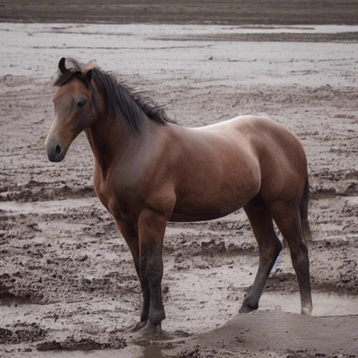
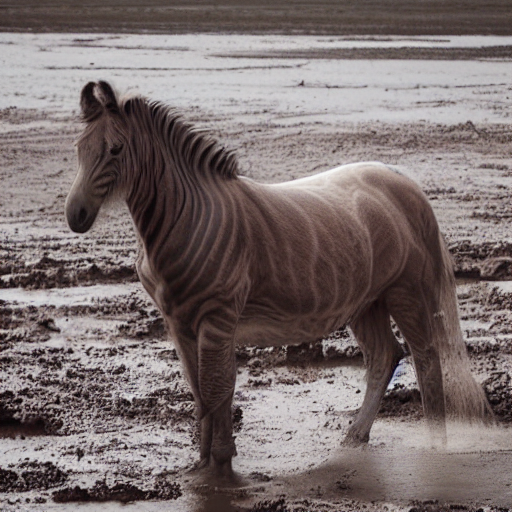

# The unofficial implementation of Prompt Tuning Inversion for Text-Driven Image Editing Using Diffusion Models

paper link: https://arxiv.org/abs/2305.04441

 

### The left one is the original image and the right one is the edited image with prompt "a photo of zebra in the snow"

### Please read the paper for more details!